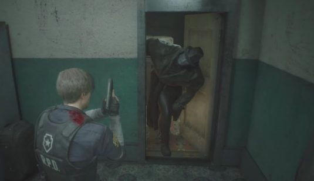
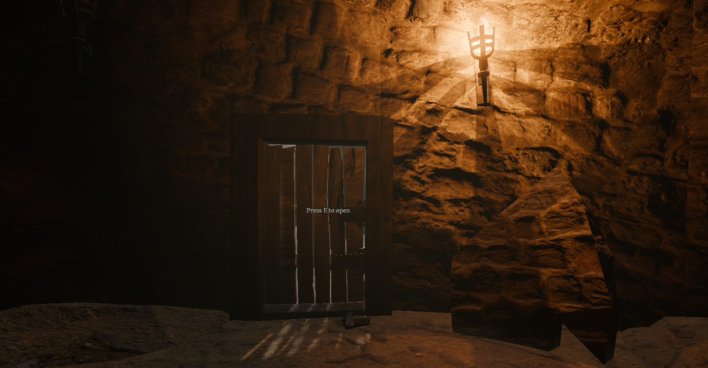

> Official docs: [link](https://docs.godotengine.org/en/stable/classes/class_signal.html)
> Official tutorial: [link](https://docs.godotengine.org/en/stable/getting_started/step_by_step/signals.html)
{: .prompt-book }


## About

Blog is about understanding basic usage of the Godot's signals using Event Driven Architecture perspective.


### About me and how it all happened

I have a backend development background (distributed systems, microservices, all this stuff), but never worked with game engines.
I started to learn the Godot less than a year ago, and for the most part of it I was hesitant at using Godot signals. They felt like a scary hack which ruins architecture.
I saw that some more experienced Godot creators share the same disbelief, as well as a couple of projects where signal usage damaged the readability (in my opinion).

At the same time, Godot promotes it as one the key features, interactions with built-in classes often imply signal usage and there are firmly integrated into UI.
Also game application is a monolith, which means that if we don't decouple our components, no one would. And signal looks like event that can be sent... can't be that bad, right?

Well, I started using them, naturally trying to apply my Event Driven Arcitecture knowledge. Of course the resemblence sometimes is almost metaphorical (and we will see it). Still, Godot signal is commonly referred as event, and this is an interesting perspective.

This is my comparison of the Godot signal using Event Driven Arcitecture perspective. Note, that I only cover most basic signal usage (i.e the one that is recommended by godot docs). We will see, that it's more than enough for a couple of blogs.

> I will be referring to Event Driven Arcitectur as EDA.
{: .prompt-note }

### Who is this article for?

I wrote key parts with such audience in mind: "Understands software patterns, in particular EDA; noob at Godot".
But actually I explain a lot about Event Driven Architecture itself, while also addressing common misconceptions about signals in Godot community.
I also explain basic software principles as well, and why signals are a powerful feature.

This means that entry barrier is low, and if any of these themes are interesting for you, you might find something helpful regardlsee the skill level.
And if you are experienced at all these concepts, you are welcome to point at my mistakes.

Also this blog is a follow up to another article where I discuss more practical examples. Here is more like a theory.


## ☄️ Introduction to signals

We will start with a basic example.

### 🎵 Door SFX example

> I use gdscript language in code snippets. It is illustrative and concise. It shouldn't be a problem if you are not familiar with it, but
> note that C# may [look differently](https://docs.godotengine.org/en/stable/tutorials/scripting/c_sharp/c_sharp_differences.html#doc-c-sharp-differences),
> in particular, signals are implemented via delegates.
{: .prompt-info }


#### Simple direct call

Imaging we have a `Door` class that represents an interactable object in game and a `DoorSFXSystem` class whose responsibility is playing different door sounds.
If the player opens the door, we want to play a creaking sound.

This is a basic object relationship:

```gdscript
class_name DoorSFXSystem

func play_sound():
	# playing sound
```

```gdscript
class_name Door

var sfx_system: DoorSFXSystem

func open_door():
	# some opening logic
	sfx_system.play_sound()
```

> We are interested in code relationships, but for a full picture note that In Godot it would also mean that we have
> a Door [scene](https://docs.godotengine.org/en/stable/getting_started/introduction/key_concepts_overview.html#scenes),
> where `Door`'s code is root node and `DoorSFXSystem`'s script is a child node.
{: .prompt-info }

#### Why direct call dependency might be undesired

We can see here that the door depends on its sfx system. Why this can be an issue?

First thing is that any change to `DoorSFXSystem` implementation would require the changes on the door side.
Same problem if we would want to completely replace `DoorSFXSystem` with, let's say, one generic `PropSFXSystem` which covers all interactable items in game.

> It is common to solve this via [DIP principle](https://en.wikipedia.org/wiki/Dependency_inversion_principle)
> (adding `SFXSystem` interface, injecting `DoorSFXSystem` implementation while initialising the door, etc).
{: .prompt-info }

Besides that we need to deal with initialization, validation, and runtime safety measures:
  1. Door's `sfx_system` variable should be initialized (I didn't cover that in the code). It can be a part of Door's constructor, high level manager or Godot-specific features (like @ready and @export), but either way we need to maintain this logic.
  1. This assignment should be validated, probably by the door (is `sfx_system` ready to use as `DoorSFXSystem`?)
  1. During runtime door also needs to keep an eye on it (is `sfx_system` still ready to use? may be someone deleted it?).

If we managed to address or pevious potential issues, further working with the door may lead to further challenges:
* What if we want a silent door (no sfx system at all)?
* What if on door opening we also want another VFX system to create dust effect, achievement system to count how many doors the player has opened, and many other?
* What if we want to dettach and add sfx system dynamically all during the door's life cycle?


#### How event approach solves this via decoupling

> I talk here about event definition, but not actually about what EDA means. If you unfamiliar with it, don't worry. 
> I will be gradually revealing different concepts of it throughout the article. And the essense of it is captured right here using only event definition and the door example. 
> {: .prompt-tip }

One way to address this design issues it to use Event Driven Architecture (EDA) and [Event](https://en.wikipedia.org/wiki/Event_(computing)) concept in particular (also known as 'message' or 'notification', depending on the context):
> In computing, an event is a detectable occurrence or change in state that the system is designed to monitor, such as user input, hardware interrupt, system notification, or change in data or conditions. When associated with an event handler, an event triggers a response.

If this sounds scary, let's leave only key parts:
> An event is a *detectable occurrence* or *change in state*. When *associated* with an *event handler*, an event *triggers* a response.

How it applies to our door?

"Change of state" is that the door started to be opened (closed -> opened). Event represents this change.
"Detectable occurrence" usually means that this event is being sent (or "emitted"). This is how we know that it actually happened.
"Event handler" is a function at the sfx system side which plays a sound, and "associated" means that somehow we connect our event and this "handler" funcion. 
This operation is commonly called "subscribe", while as we will see a bit later, Godot uses exactly "connect".

All together:
* Door sends an event about it being opened.
* Sfx system subscribes to this event during the initialization
* During runtime Sfx system would play the sound on receiving such an event.

This means that the door not only does not have a dependency on sfx system, but **it has no idea such system exists**.

The only question is how to do this in our code.
We don't want to implement some specific EDA pattern in Godot, right? This would require not a blog, but a couple of books (of a dubious value).
Luckily, we have Godot signals.

#### Actual decoupling using Godot's signals

Finally, let's look at the signals. How official docs describe them:
> Signals are a delegation mechanism built into Godot that allows one game object to react to a change in another *without them referencing one another*.

This is exactly what we need!

How to use them? We have two main functions: `emit` and `connect`. 

Now instead of `Door` calling `DoorSFXSystem`, sfx system *connects* to the specific `Door`'s signal.
The **Door** would *emit* it instead of the direct call to `DoorSFXSystem`.

```gdscript
class_name DoorSFXSystem

var door: Door

func _ready():
	door.door_opened.connect(_on_door_opened)

func _on_door_opened():
	# play sound
```

```gdscript
class_name Door

signal door_opened

func open_door():
	# some opening logic
	door_opened.emit()
```

We did exactly what was descibed using event concept. 

Let's pinpoint the key difference between the direct call and the signal: 
the dependency between `Door` and `SFXSystem` **has been reversed**: `SFXSystem` now depends on `Door`.
We will be referring to this fact many times.

Also note that I renamed `play_sound` function to `_on_door_opened`. This is optional and does not affect the code flow, but serves two purposes:
 * prefix `_` accents that the function is now private. This is no longer a public API that the `Door` (or any other class) can call.
 * `on_door_opened` semantics follows the Godot naming convention: "_on_node_name_signal_name". Godot calls such functions **callbacks**


> Term 'signal' has [different well-known](https://en.wikipedia.org/wiki/Signal_(IPC)) connotations. 
> I always refer to [Godot's signal](https://docs.godotengine.org/en/stable/classes/class_signal.html) in this article. 
> {: .prompt-info }


## Signals are not events in a common sense

We saw that the signal represents a state change ("door has been opened"), how it solved the typical problem which requires events, and it solved it in a "EDA" fashion:
Sfx system subscribed to door's signal; door sent this signal; sfx system logic was triggered by it. This is typical EDA.

Also official tutorial starts with using such words:
> In this lesson, we will look at **signals**. They are **messages** that nodes emit when something specific happens to them, like a button being pressed. Other nodes can connect to that signal and call a function when the **event** occurs.

Let's also explore built-in Godot signals (after all, door example was made up). Usually they represent the state change: `BaseButton` has `pressed` signal; `Node` has `child_entered_tree`;  `Node3D` has `visibility_changed()`. 

If we use the word "event" not as a term, signal is clearly is an event.

If we use it like a term...

Firstly, there is no strict definition: it depends on the area, use cases, implementations. I tried to discuss the EDA essense of it, and signal fits this.
That being said, there are common assosiations with events usage, especially with EDA, and they does not fit our signals. 
Also we will see that technically signal and an usual event have very little in common. 

At the same time, I will show how we can learn from EDA even when it contradicts signals nature. 

Let's explore all this.

> "Event" term used in different areas, like [hard ware interruptions](https://wiki.osdev.org/Interrupt_Service_Routines) or
> [OS loops](https://learn.microsoft.com/en-us/windows/win32/winmsg/about-messages-and-message-queues). 
> Here in article I ignore such connotations and refer to "event" in a EDA sense. This does not mean that I imply only distributed systems, though.
> Components inside one application can be very well event driven. In fact, Godot manages user inputs [via events](https://docs.godotengine.org/en/stable/classes/class_inputevent.html#class-inputevent). Another example can be seen [here](https://youtu.be/MX2PNIzxXMc?si=DmyY1OUucaGeF4cM).
{: .prompt-info }


### Let's prepare

Some preparations before talking about differences.

#### Event-related terms we will borrow

Let's start with using EDA "lenses" and borrow some terms from it (later we will see that such things should be done coutiosly).

It is common to call a system that emits the event a **Publisher** and system which listens to such events **Subscriber**.

In our door example, `Door` is a **publisher** and `SFXSystem` is a **subscriber**.


#### New reference example

I will be talking about different practical examples in the next blog. But relying only on door flats our perspective, and I feel like imposter a bit.

Let's retell the example from the [official tutorial](https://docs.godotengine.org/en/stable/getting_started/step_by_step/signals.html#custom-signals).

Player character has a health attribute and on receiving the damage it emits a signal about health being changed.

```
class_name Player

signal health_changed(new_amount)

var health = 10

func take_damage(amount):
	health -= amount
	if health <= 0:
	  health_changed.emit(health)
```

This signal also has an additional data (`new_amount`). We will talk about this mechanics later. 

Subscriber can be an UI system which shows the players health on the screen. 

> We said that both event and signal represent a state change (door probably went from closed to open, while built in button goes from normal to pressed).
> Does this example contradicts this? We talk about health and not about player's state machine (i.e. discussing player_died signal). 
>
> No, any class attribute describes the state of the object (OOP paradigma), and changing such attribute is a notable difference in a state. 
> If other systems rely on this, having a dedicated event is perfectly fine. 
>
> You can also think about it this way: in real game character resources are important, and we probably would've have a dedicated health class: 
> ```
> class_name Health
> 
> var amount
>
> signal health_changed(new_value)
> ```
> Signal has the exact same meaning, but now its "state nature" is more illustrative and closer to our `door_opened` 
{: .prompt-mug }


### Synchronicity: Not the event that you think it is

Ok, let's finally explore what can be wrong with our extensive usage of the word "event".

Event Driven Architecture may mean [a lot of different things](https://youtu.be/STKCRSUsyP0?si=AIqlRfyynrLzspT8), but it is common to assosiate it with asynchonous interactions.
It is actually one the [main selling points](https://www.ibm.com/think/topics/event-driven-architecture):
> EDAs enable systems to work independently and *process events asynchronously*.

If we talk strictly about events, there are [just ojects](https://microservices.io/patterns/data/domain-event.html), and implementation decides how operate them. [From wiki](https://en.wikipedia.org/wiki/Event_(computing)):
> The handler *may run synchronously*, where the execution thread is blocked until the event handler completes

But again, it is common to assosiate events with asyncronous "fire and foget" interaction: publisher sends an event and continues to do its own stuff. 

This is **not** our case.


#### Signals are synchronous

> I'm not a Godot engine expert, my knowledge about this part comes from empirical tests and C++ signal API implementation research. 
> This part may contain inaccuracies and misconceptions.
{: .prompt-warning }

> [OS loops](https://learn.microsoft.com/en-us/windows/win32/winmsg/about-messages-and-message-queues) and many other things. 
> Here I ignore such connotations and refer to "event" in a EDA sense. This does not mean that I imply only distributed systems, though.
> Services inside one application can be very well event driven. 
{: .prompt-mug }




Signals are synchronous and act just like a function call.

It's a common misconception to assume otherwise, and I think there two reasons for that.

First reason we already mentioned: EDA is assosiated with asyncronous interactions, and just by using the word "event" it becomes easier to forget that Godot's application
[is a monolith](https://docs.godotengine.org/en/stable/_images/godot-architecture-diagram.webp), and we don't deal with services which are being process by their own host machines and send the events over the network (the word 'signal' doesn't really solve this wrong assosiations as well).

Secondly, documentation does not emphasize it (I presume this is a common knowledge that client code runs using one thread?).
There is a funny proof of that, top links that pop up in the search:
- Reddit post that claims "I just learned that signals are completely asynchronous"
- Godot [forum thread](https://forum.godotengine.org/t/are-signals-fired-synchronically/80009) where confused people make wrong assumptions, decode C++ engine implementation and eventually get to the  truth

So emitting a signal is a **synchronous operation** by default. App's code (the one you wrote) is run by one thread.
When out door emits its signal, the game's execution thread stops, goes to the `DoorSFXSystem` to play a sound, and then returns to the `Door` code.

What that means for us?

#### Publisher haults

Well, firstly, publisher stops doint its thing on emitting signal.
It will continue just after subscriber's finidhed processing this signal.

This is such a primitive idea if we think about function calls, but words 'emit' and 'signal' make this a bit weird (even if we forget about EDA).

#### Signals don't make a system less traceble

Event Driven Architecture has a well known trade off: component interaction is hard to debug. Decoupling leads to separation of "cause and effect" and a failure can't be traced just by a linear call stack. Well, you might have guessed it: this is not the case with our signals.

Let's debug this:

```gdscript
extends Node

signal test_signal

func _ready():
	test_signal.connect(_on_test_signal)
	run_sync_test()

func run_sync_test():
	print(">>> Step A: Before emit")
	test_signal.emit()
	print(">>> Step C: After emit")

func _on_test_signal():
	print(">>> Step B: Inside handler")
```


_We are inside `_on_test_signal` function; we have one thread and three stack frames_

Output:

```console
>>> Step A: Before emit
>>> Step B: Inside handler
>>> Step C: After emit
```


#### Emitting many signals is fine

Another common misconception about signals is that you should not emit them in the loop (i.e on every engine frame).

From the design perspective it is actually valid, and ironically EDA analogy helps us to see that: it is rare that object changes its state on every processing tick.
But technically, since it is just a function call, it should not be a problem (goes without saying that in distributed systems this would be a technical hell).

There is an [GDQuest article](https://www.gdquest.com/tutorial/godot/best-practices/signals/) that addreses this directly:
> In gdscript, emitting a disconnected signal barely costs more than a function call.
> When connected to one node, emitting the signal plus its callback costs a little over three times slower than a direct functions call.

> This article covers many interesting topics that the official tutorial lacks, but was written for Godot 3 (March 30, 2021). 
> Signals were severely redesigned in Godot 4 (in particular, they became first-class type). 
> I don't have enough knowledge about what actually changes, so to be on a safe side I sadly wouldn't actually recommend to rely on this source.
{: .prompt-warning }


#### Can we make it asynchronous?

We can easily solve "publisher haults" problem.

Godot has a [call_deferred](https://docs.godotengine.org/en/stable/classes/class_callable.html#class-callable-method-call-deferred) feature. 
It "schedules" any function call until the end of the current frame. We can use this on the publisher side.

Also on the subscriber side we have an [API flag](https://docs.godotengine.org/en/stable/classes/class_object.html#enum-object-connectflags).
I haven't used it but assume it will do the same but is "baked" into signal API to make it more handy.

> Note, that code will still be computed synchoniously. But publisher *may be* desicribed as it "fires and forgets".
{: .prompt-warning }

To make this truly asynchronous, we can use the [threading API](https://docs.godotengine.org/en/stable/tutorials/performance/using_multiple_threads.html). 
But I assume that implementing popular EDA interactions usign threads would not require signals at all. 
Either way, asynchronous signals are beyond the scope of this article.


#### Publisher-subscriber pitfall

Since we talked about how words may bring undesired assosiatins, I want to mention that "Publisher-Subscriber" may be described as a pattern on its own: [link](https://learn.microsoft.com/en-us/azure/architecture/patterns/publisher-subscriber), [link](https://en.wikipedia.org/wiki/Publish%E2%80%93subscribe_pattern). It may have different definitions, but, as we probably expect it already, "asynchronous" communication is emphasized.

I still decided to use words publisher and subscriber, but it is an illustrate that such "borrowing" should be made with caution.
Assume you started to use this terms in your documentation and code: a new developer who is not familiar with signals may be easily misguided by them. 

> About alternatives
> * We need words to describe "the one who emitted event" and "the one who listens to it". Emitter/Connector or Sender/Listener sound either abstract or awkward in my opinion.
> * Publisher/Subscriber are common: in official [tutorial comments](https://docs.godotengine.org/en/stable/getting_started/step_by_step/signals.html) the word 'subscribe' is widely used (to be fair, "publish" is never used).
> * In distributed systems Producer/Consumer is a common pair, but it is mostly the same. 
{: .prompt-mug }


### Other differences: event routing, event payload

#### Signal imply Event Routing

There is another crucial difference between the event and a signal. 

Event is just a container which holds information. All events are treated the same (i.e passed between functions, stored in databse, sent over the network), 
and typically a subscriber is exposed to any event in the system. Publishers "broadcast" their events and subscribers pick only those that matter for them.

Common solution is to include event type in the event structure:
```gdscript
class_name Event

var event_type
```

> Usually event has additional fields to describe what actually happened (like an object ID),
> as well as technical fields like `event_id` or `timestamp`. This is not important for us here so I greatly simplify the examples.
{: .prompt-mug }


A subsriber needs to filter all the events and work only with the specific ones: `if event.event_type == "door_opened"`

This does no scale well: if you have 100 different event types, DoorSFXSystem would be triggered of every of them, while actually working only with one.

There is a common solution to it, called [Event Routing](https://oneuptime.com/blog/post/2026-01-30-event-routing/view): 
directing events to the appropriate subscribers, i.e making this "filtering" no on the subsciber side.

In case of Godot signals, we don't need any of that. Subscriber connects to a specific event and its logic would be triggered only by that event.
Signal should not carry its type, and the routing feature is happening naturally.  
In fact, just the opposite: we cannot "broadcast" a signal to all the subscribers *unless they explicitly chose to subscribe* to it.

In a sense, code line `door_opened.emit()` is a router itself.

But where that "event type" information is actual located? It is *the name* of the signal variable. 
Event type is just a name that we give our object instance *by convention*. It is not really used anywhere (while events imply something like `if event.event_type == "door_opened"`).

>Approach with `var event_type` is convenient because an event can be easily stored in database (be represented as a row of table) 
> or be sent over the network (serialised to JSON or similar structure).
> If we don't talk about distributed systems, and events are used inside one application, we can "encode" event type into class type:
>
>```gdscript
>@abstract
>class_name Event
>```
>
>```gdscript
>class_name DoorOpened
>extends Event
>```
> This makes our event looking closer to signal, while all the mentioned differences are still valid.
{: .prompt-mug }


#### Signal is not a data, but may tranfer it

As we saw, an event almost always carry some data (like event_type), as this data *is* the event. 
Such essential data is commonly refereed to as a [payload](https://en.wikipedia.org/wiki/Payload_(computing)), and I will be using this term: 
> payload is the part of transmitted data that is the actual intended message


Usually payload is represented as a JSON like structure. Our healh example will be looking this this:

```gdscript
class_name Event
var payload: Dictionary # example: {"event_type": "HealthChanged", "new_amount": 5}
```

In case of signals, we saw that having `door_opened` signal is enough. 

But additional information may still be useful. Godot allows us to attach additional data while emitting a signal. 

We saw it with health example, but let's do the same with the door.

```gdscript
signal door_opened(initiator: String) 

door_opened.emit("Mr. X")
```

Subscriber would need to define its callback accordingly:

```gdscript
func _on_door_opened(initiator: String):
	# ...
```

Here parameter of the `emit` is just a way to pass it as an argument to function  `_on_door_opened`.

While this mechanics naturally stems from the direct call nature of signals, it has a lot potential problems. I will be talking about that in my next blog.





### Differences sum up

To conclude, let's list what we've learned. 

*_Event_*

* Technically an instance of the class (OOP). 
* Has explicit data; It *is* the data; 
* Being passed in order to deliver this data to someone else. 
* May be routed via other systems to optimise the deliverence.
* Usually is passed asyncronously: publisher and subscriber are independent threads (or processes) which are independent

*_Signal_*

* Is also an object, but this object represents a fancy direct call; 
* By convention the name of this object represents the data change;
* May pass additional data using basic procedural language ability, but this data is not the part of the object.
* Can be seen as a router itself.
* By default is synchronous: publisher and subscriber are the same code run by one thread; publisher waits for subscriber.


Now what makes them similar:
* Represent an object's *state change*
* Are used to *categorize* different changes in state
* Publisher uses them to *notify other systems* about the change, i.e make it "public"
* Subscribers should be *configured to react* to such "changes" in advance
* During runtime subscribers *react* on publishers's "changes" accordingly
* May have additional data assosiated with them

Which leads to similar use cases:
* Decouple the logic of publisher and subscriber
* Tranfer the data between publisher and subcsriber

I would say that Godot's signal *can be treated* as a natively built-in to language **[event pattern](https://en.wikipedia.org/wiki/Event_(computing))**.
This implies that we might use EDA "lenses" while looking at signals and their usage. But we should be aware of differences and don't let them misguide us.


## But what software pattern we actually use?

### Observer

Official tutorial tells you:
> Signals are Godot's version of the observer pattern. You can learn more about it in [Game Programming Patterns](https://gameprogrammingpatterns.com/observer.html)

While comparing with observer is understandable, it may also create a confusion: 
this pattern means that the publisher (**Subject**) manages its subscribers (**Observer**) 
[[link_1](https://refactoring.guru/design-patterns/observer/python/example), [link_2](https://en.wikipedia.org/wiki/Observer_pattern)]:

Recreating [this article](https://gameprogrammingpatterns.com/observer.html) with our door example would look roughly like this:

```gdscript
@abstract
class_name Observer

@abstract
func on_notify(event: String)
```

```gdscript
@abstract
class_name Subject

@abstract
func notify(event: String)
```

```gdscript
class_name SFXSystem
extends Observer

func on_notify(event: String):
	if event == "door_opened":
		# <play sound>
```

```gdscript
class_name Door
extends Subject

var _observers: Array[Observer] = []

func notify(event: String):
	for observer in _observers:
		observer.on_notify(event)
```

While it can be said that dependency is inversed (using DIP), during the run-time Door is still dependent on SFXSystem. 
This is a common "trait" of observer, for example, you need to make sure that [observers are ok on the Door side](https://gameprogrammingpatterns.com/observer.html#destroying-subjects-and-observers).

But first thing we saw is that how signals helped to reverse the depencency between `Door` and `DoorSFXSystem`. Observer design directly contradicts it.

On the other hand, Observer actually perfectly captures signal's synchronous direct call nature (`observer.on_notify(event)` is indeed a direct call). 
From the [wiki](https://en.wikipedia.org/wiki/Observer_pattern):
> ... multiple observers can listen to a single subject, but the coupling is typically synchronous and direct

### Finding EDA pattern

Observer is one of the [Gang of Four](https://en.wikipedia.org/wiki/Design_Patterns) design patterns. 
EDA was not a formulated term back then. Let's try to find something more suitable inside the EDA "toolbox".

Can we just declare our signals to be "event driven"? But what does that mean, exactly?

Martin Fowler has described four main patterns of EDA: [201701-event-driven.html](https://martinfowler.com/articles/201701-event-driven.html).

He calls the first and most common one as **Event Notification**:
> This happens when a system sends event messages to notify other systems of a change in its domain.
> A key element of event notification is that the source system doesn't really care much about the response.

This article is accompanied by GOTO talk, where he emphasizes([timestamp](https://youtu.be/STKCRSUsyP0?si=wMKupqLgTuDpShZp&t=416)):
> "the essence is reversal of dependencies."

Mission accomplished! **Event Notification**'s essence is what Observer's design lacked.
In fact, this is the first thing I pinpointed in introduction.

We will we be referencing this pattern here in article, but it doesn't mean that signals should be described like that.

* **Event Notification** sounds too abstract, and can't be treated as a "coined" term (like "CQRS", for example).
* Tt has this strong "distributed systems" feeling to it, hence the majority of the examples in the article and talk are about microservices. 
Of course this does not mean that we can't apply this pattern synchonously in a monolith. But the naming is more misleading than helpful for us.
(to be fair, "notify" can be used in synchronous sense, we just [saw it](https://gameprogrammingpatterns.com/observer.html#the-subject) in Observer pattern).

Also note, that of course you can build any pattern that Martin Fowler described.
But basic signal usages (official tutorial, our examples) are synchronous implementation of the **Event Notification**.

### Observer + Event Notification

Observer pattern misses "reversal of dependencies" point but emphasizes the synchronous nature of signals, it is also widely recognisable.
**Event Notification** gets the dependency reversal just right but sounds too abstract and may imply asynchronous interactions.


## Let's wrap

We can see, that signals can be applied in an EDA fashion, and in terms of a "fact happened" signal can be seen as an event.
But differences are massive, and there is no high level pattern that will perfectly capture all the intricasies that we deal with.

This is perfectly normal: both similarities and discrepancies with patterns and use cases that other smart people have established will help us better understand what we do with our signals, 
and how it fits into the "global world".

It might also help to deal with official documentation imperfections and better evaluate information from the web.

As a small bonus, let's apply this right now.

Let's take a look at [this clip](https://youtu.be/MWHFV_BPqkA?si=_SInfWhNvBcTHf4R&t=384). Possible critics:
* **Event Notification** traits are listed, not the Observer's.
* There is a mentioning of nodes, that "react independently in their own threads". In case of default signal usage in Godot this is not true.

Another example can be found [here](https://youtu.be/b3uFSh3GASs?si=SAyHDv9h_JcHV1Qb) at the video description:
> ... we are building bridges between our well encapsulated character controller and the rest of the game world. Godot has powerful events routing system called signals, and at first it seems that collision with an enemies sword is exactly the case for using them. But in a big game, we'll either have zero signals or like 50, and a *system that has its logic built with 50 events is hardly ever can be debugged and/or scaled properly*.

One now might argue that:
* because of the *difference* between the signal and event, 50 signals should not be that hard to debug.
* because of the *similarity* between the signal and event, they actually should help us to scale our systems.

Also in my opinion signals are actually a good candidate to "bridges between character and the rest of the game world", 
as EDA events are commonly used to connect independent components (to cross between bounded contexts, you might say). But this would be covered in my next blog.


> I am saying this respectfully and want to note, that first author created an open source [game template](https://github.com/catprisbrey/Cats-Godot4-Modular-Souls-like-Template)
> with custom CC0 assets, including SFX and third person animations (not mixamo!), which is truly unique. And speaking about another video mentioned, I learned more from [this channel](https://www.youtube.com/@PointDown) than anywhere else about game mechanics. Author also has [open source repositories](https://github.com/Gab-ani).
{: .prompt-mug }
