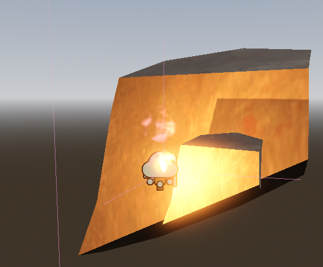

# Hello blog

hey
**hi**
_test_

##

### Auto disabling

Godot has a node which disables the process based on the camera frustum. See official docs for [VisibleOnScreenNotifier3D](https://docs.godotengine.org/en/stable/classes/class_visibleonscreennotifier3d.html).

Many objects in project use this node, sometimes with additional QoL features like auto sizing.

🔽 Expand to see screenshots 🔽

 
Fire node (used for torches):

VisibleOnScreenNotifier3D cube around the fire node:

Fire node settings: we can set cube size or auto calculate it using the omni light radius (part of the fire scene).

Similar with node that makes the parent swaying: we can set the cube size or auto calculate it using parent's AABB parameters:

## 🥧 Light baking

Project uses light baking for some specific scene.
Not all usages of it lead to any measurable performance gain (at least I haven't spotted it in profilers): sometimes it is used only for aesthetic or 🧪 scientific reasons.
